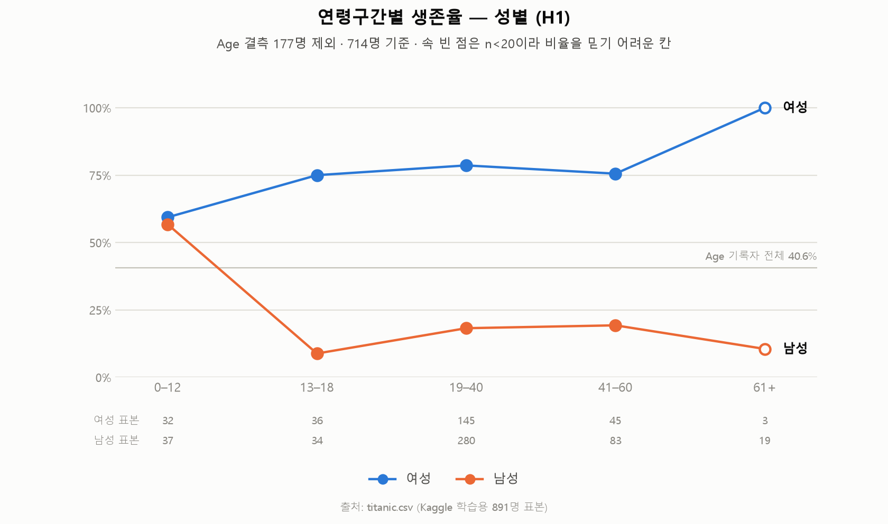
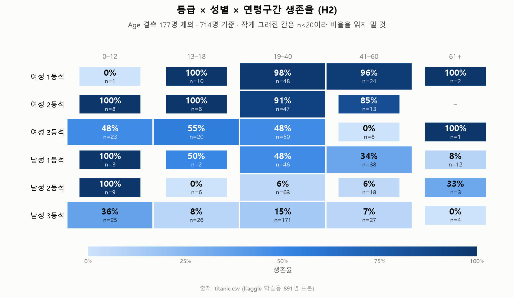
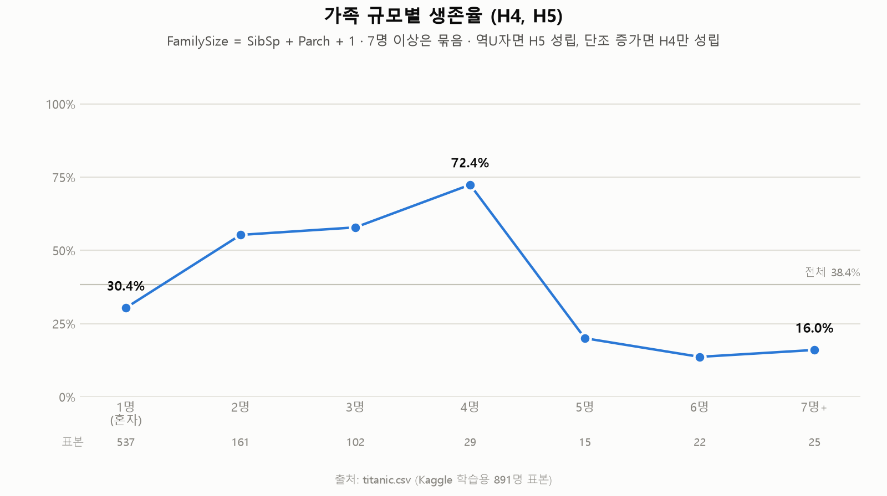
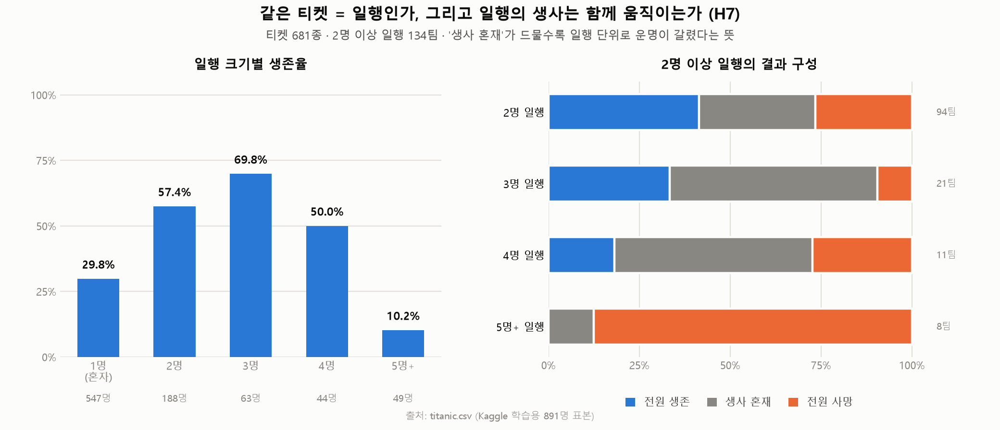
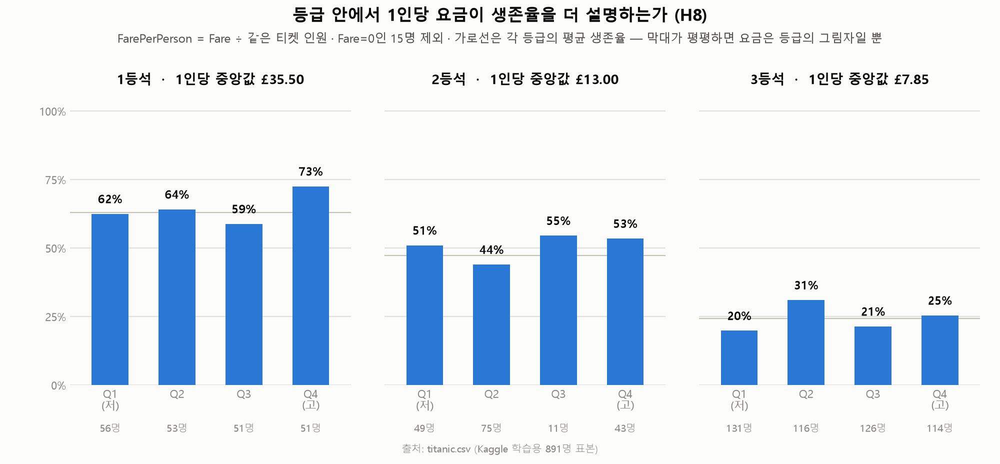
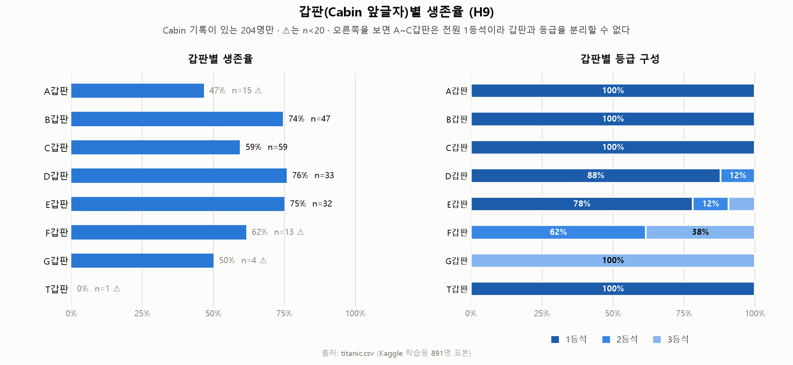
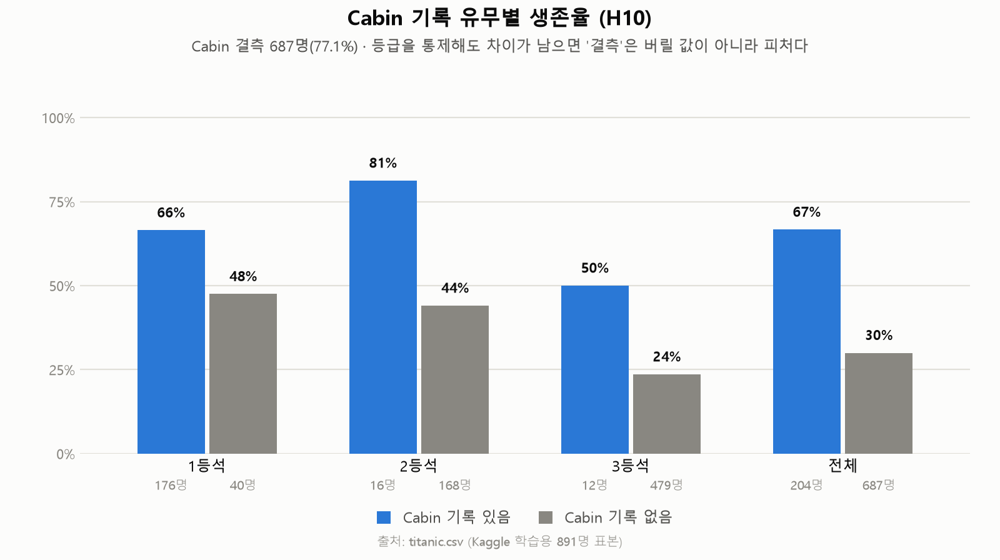
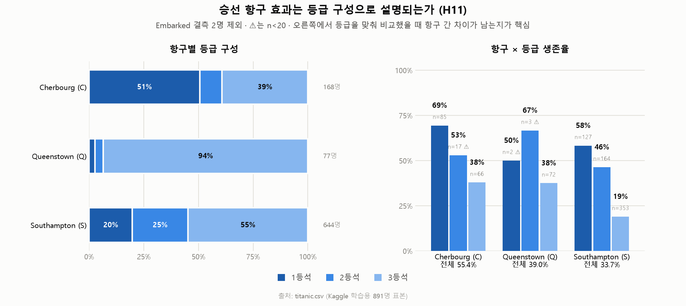
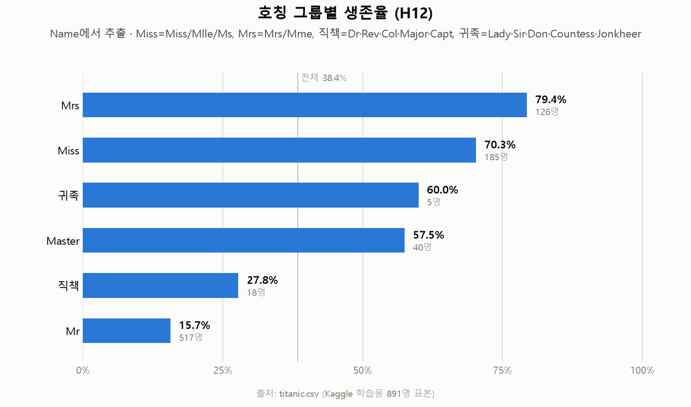
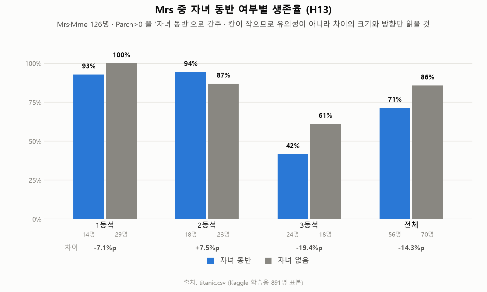

# titanic.csv 분석 가설

컬럼 정의와 결측 현황은 [[titanic 데이터 설명]] 참고.

이 문서는 **가설 목록 + 각 가설의 기술통계 차트**다. 차트는 `hypothesis_viz.py`로 생성하며,
각 가설 아래 "차트에서 보이는 것"은 **그림을 읽은 서술일 뿐 통계적 검정 결과가 아니다.**
유의성 검정·회귀·다중비교 보정은 아직 하지 않았다. H3·H6은 차트가 없다(사유는 해당 항목에).

```
python hypothesis_viz.py          # 10종 전부, 라이트
python hypothesis_viz.py --dark   # 다크
python hypothesis_viz.py --only age
```

## 전제

- 표본은 891명. 실제 탑승자 약 2,224명의 **부분 표본**이므로, 결과는 "이 표본에서"로 한정해 서술한다.
- `Survived`가 타깃. 대부분의 가설은 "X가 생존 확률과 연관이 있는가" 형태다.
- **연관 ≠ 인과.** 이 데이터로는 교란변수를 통제한 연관까지만 말할 수 있다.

## 기준선 (이미 계산한 값)

| 구분 | 생존율 |
|---|---|
| 전체 891명 | 38.4% |
| 남성 577명 / 여성 314명 | 18.9% / 74.2% |
| 남성 1·2·3등석 | 36.9% / 15.7% / 13.5% |
| 여성 1·2·3등석 | 96.8% / 92.1% / 50.0% |

여기서 이미 드러난 것: **성별 효과가 등급 효과보다 크다**(3등석 여성 50.0% > 1등석 남성 36.9%).
따라서 이후 모든 가설은 **성별과 등급을 통제한 뒤에도 효과가 남는가**를 기본 질문으로 삼는다.

---

## A. 나이와 생애주기

### H1. 어린이는 같은 성별·등급의 성인보다 생존율이 높다
- **근거**: "여성과 어린이 먼저" 관행이 실제로 작동했다면 연령에 임계값이 보여야 한다.
- **검증**: `Age`를 구간화(0–12 / 13–18 / 19–40 / 41–60 / 60+)하고 `Sex` × `Pclass` 층별로 생존율 비교.
  연속형으로는 로지스틱 회귀에 `Age`를 넣어 계수 부호 확인.
- **주의**: `Age` 결측 177건(19.9%)을 평균으로 대치하면 효과가 희석된다. 우선 **결측 제외 714명**으로 보고, 대치는 따로.
- **반증 조건**: 층별로 나눴을 때 연령 구간 간 생존율 차이가 사라지면 기각.



- **차트에서 보이는 것**: 어린이 효과가 **남성에서만** 나타난다. 남성은 0–12세 56.8% → 13–18세 8.8%로 급락하고
  이후 평평하다. 여성은 전 연령 75% 내외로 평평하며, 오히려 여아(59.4%)가 성인 여성보다 낮다.
  → "여성과 어린이 먼저"의 **어린이** 조항은 사실상 남아에게만 작동한 모양새다. 61+ 여성은 n=3이라 읽지 말 것.

### H2. 어린이 효과는 3등석에서 약하다
- **근거**: 구명정 접근성이 등급에 좌우됐다면, 관행의 혜택도 등급에 따라 다르게 적용됐을 것.
- **검증**: `Pclass` × 연령구간 교차표를 남아/여아 각각에 대해. 3등석 어린이 셀 크기부터 확인.
- **주의**: 1·2등석 어린이는 표본이 작다. 셀 n < 20이면 비율 대신 카운트로 제시.



- **차트에서 보이는 것**: 3등석 어린이는 여아 47.8%(n=23) / 남아 36.0%(n=25)로, 1·2등석 어린이(대부분 100%)와
  확연히 다르다. 어린이 효과가 3등석에서 약하다는 방향과 일치한다.
  단 1등석 여아 n=1, 1등석 남아 n=3이라 "1·2등석 어린이 100%"는 사실상 2등석(n=8, 9)이 떠받치는 숫자다.
- **부수적으로 보이는 것**: 남성 1등석은 48% → 34% → 8%로 나이에 따라 단조 감소한다. 여성 쪽엔 없는 패턴.

### H3. `Name`의 `Master` 호칭은 `Age` 결측을 메우는 대리 지표가 된다
- **근거**: `Master`는 미성년 남성에게 붙는 호칭이고, 40건 존재한다.
- **검증**: `Master`인 행 중 `Age`가 있는 것들의 나이 분포를 확인 → 상한이 실제로 청소년대에서 끊기는지.
- **활용**: 성립하면 H1의 `Age` 결측 대치를 호칭별 중앙값으로 하는 근거가 된다.
- **차트 없음**: 이건 생존율이 아니라 **나이 분포**를 봐야 하는 가설이라 형식이 다르다(호칭별 나이 히스토그램 또는 점 플롯). 아직 만들지 않았다.

---

## B. 가족과 동행

### H4. 혼자 탄 승객은 생존율이 낮다
- **근거**: 동행이 있으면 서로 찾고 구명정으로 이동시키는 행동이 가능하다.
- **검증**: `FamilySize = SibSp + Parch + 1` 파생 → `IsAlone` (FamilySize == 1, 537명 규모 예상).
  `Sex` × `Pclass` 통제 후 생존율 비교.
- **반증 조건**: 성별 통제 시 차이가 사라지면 기각(혼자 탄 사람 중 남성 비율이 높아 생기는 착시일 수 있음).

### H5. 가족 규모와 생존율은 비선형(역U자) 관계다
- **근거**: 2–4인은 유리하고, 5인 이상 대가족은 오히려 흩어지거나 서로를 기다리다 불리해진다는 가설.
- **검증**: `FamilySize`별 생존율 꺾은선. `SibSp`는 최대 8, `Parch`는 최대 6이므로 꼬리 구간은 n이 한 자리수 — 5+ 로 묶는다.
- **주의**: 대가족은 3등석에 몰려 있을 가능성이 높다. 등급 통제 필수.



- **차트에서 보이는 것 (H4·H5 공통)**: 혼자(537명)는 30.4%로 전체 평균 38.4%보다 낮다 → H4 방향과 일치.
  모양은 4명(72.4%, n=29)을 정점으로 한 **역U자**가 뚜렷하고 5명부터 급락(20.0% → 13.6% → 16.0%) → H5 쪽.
- **아직 못 한 것**: 성별·등급 통제 전이다. 혼자 탄 537명에 남성이 몰려 있으므로, 이 차이의 상당 부분은
  성별로 설명될 수 있다. 5명+ 구간이 3등석에 쏠린 것도 마찬가지다.

### H6. `SibSp`(형제자매·배우자)와 `Parch`(부모·자녀)의 효과 방향은 다르다
- **근거**: "자녀를 동반한 부모"와 "형제와 함께 탄 성인"은 행동이 다르다. 둘을 합치면 효과가 상쇄될 수 있다.
- **검증**: 두 변수를 따로 넣은 로지스틱 회귀에서 계수 부호·크기 비교.
  특히 `Parch > 0`인 성인 여성(어머니)과 `Parch > 0`인 성인 남성(아버지)을 나눠서.
- **차트 없음**: 회귀 계수 비교가 본체라 그림 한 장으로 답할 수 없다. `Parch` 쪽 일부는 아래 H13에서 먼저 확인 가능.

### H7. 같은 `Ticket` 번호는 일행을 뜻하고, 일행의 생사는 함께 움직인다
- **근거**: `Ticket` 681종 / 891명, 중복 티켓에 속한 인원이 344명. `SibSp`·`Parch`로는 안 잡히는 동행(친구·하인·유모)을 포착한다.
- **검증**: `TicketGroupSize` 파생 → 그룹 내 생존율의 분산이 무작위 배정 대비 낮은지(그룹 내 전원 생존/전원 사망 비율이 기대치보다 높은지).
- **활용**: 성립하면 H4·H5보다 나은 "동행" 정의가 된다.



- **차트에서 보이는 것**: 오른쪽이 핵심이다. 2명 일행 94팀 중 생사가 갈린 팀은 30팀(32%)뿐이고
  나머지 68%는 전원 생존이거나 전원 사망이다. 5명+ 일행은 8팀 중 7팀이 전원 사망.
  → 운명이 **일행 단위로 갈렸다**는 방향과 일치한다.
- **아직 못 한 것**: "무작위 배정 대비"를 아직 계산하지 않았다. 일행은 성별·등급이 서로 같은 경향이 있으므로,
  전원 일치가 많은 것 자체는 동행 효과가 아니라 구성 효과일 수 있다. 순열검정이 필요하다.
- **참고**: 3·4명 일행은 오히려 혼재가 다수(3명 21팀 중 12팀)다. 일치 경향은 2인·대가족 양 끝에서 강하다.

---

## C. 등급·요금·위치

### H8. `Fare`는 `Pclass`를 통제하면 추가 설명력이 없다
- **근거**: 요금은 등급의 대리 변수일 가능성이 높다. 같은 등급 안에서의 요금 차이가 생존과 무관하다면 등급만 남기면 된다.
- **검증**: `Pclass`만 넣은 모형 vs `Pclass` + `Fare` 모형의 적합도 비교. 등급별 `Fare` 분포 확인.
- **필수 선처리**: `Fare`는 1인당이 아니라 **티켓 단위 합계**다. `FarePerPerson = Fare / TicketGroupSize`로 정규화한 뒤 비교할 것.
  정규화 전 결과는 가족 규모와 교락되어 있다.
- **주의**: `Fare == 0`인 행 15건(직원·무료 탑승 추정)은 별도 처리.



- **차트에서 보이는 것**: 등급 안에서 4분위로 나누면 막대가 거의 평평하다.
  1등석 62 / 64 / 59 / 73%, 2등석 51 / 44 / 55 / 53%, 3등석 20 / 31 / 21 / 25% — 단조 증가 패턴이 없다.
  → **H8 지지 방향**. 요금은 대체로 등급의 대리 변수로 보인다.
- **다만**: 1등석 최고분위 73%만 다른 분위보다 눈에 띈다(n=51). 여기만 따로 확인할 가치는 있다.
  2등석 Q3은 동일 요금값이 많아 n=11로 쪼그라들었다.
- **확인된 선처리 효과**: 1인당 중앙값은 1등석 £35.50 / 2등석 £13.00 / 3등석 £7.85로 깔끔히 갈린다.

### H9. `Cabin`의 갑판 문자(A~G)는 생존율과 연관이 있다
- **근거**: 갑판 위치 = 보트덱까지의 물리적 거리. C 59, B 47, D 33, E 32, A 15, F 13, G 4, T 1로 분포.
- **검증**: `Deck = Cabin[0]` 파생 → 갑판별 생존율. 단 `Pclass` 통제 필수(갑판과 등급은 거의 같은 정보일 수 있음).
- **한계**: 유효 표본 204명뿐이고 F·G·T는 한 자리수. **등급 통제 후에는 셀이 거의 비어 결론을 내기 어려울 가능성이 높다.** 이 점을 미리 인정하고 시작한다.
- **참고**: `Cabin` 값 24건은 공백으로 구분된 복수 객실(가족이 여러 방을 쓴 경우)이다.



- **차트에서 보이는 것**: 갑판별 생존율은 A 46.7%, B 74.5%, C 59.3%, D 75.8%, E 75.0%로 **물리적 순서와 무관**하게 흩어진다.
  보트덱에 가장 가까운 A갑판이 오히려 가장 낮다.
- **결론 못 냄 (예상대로)**: 오른쪽 패널이 이유를 보여준다. A·B·C·T갑판은 **전원 1등석**이고 G갑판은 전원 3등석이라,
  등급을 통제하면 비교할 칸이 남지 않는다. F 13명, G 4명, T 1명은 애초에 비율을 말할 수 없다.
- **정리**: 문서 작성 시 예상한 "결론이 안 날 공산이 크다"가 그대로 확인됐다. 이 변수는 **접는다.**

### H10. `Cabin`이 결측이라는 사실 자체가 생존과 연관이 있다
- **근거**: 결측 687건(77.1%)이 무작위가 아니라 등급에 쏠려 있다. 기록이 남았다는 것 자체가 신분·생존 여부와 상관될 수 있다.
- **검증**: `HasCabin` 이진 파생 → 생존율 비교. 그다음 `Pclass` 통제 후에도 차이가 남는지.
- **의의**: 남으면 "결측을 버리지 말고 피처로 쓰라"는 결론, 사라지면 "등급의 그림자일 뿐"이라는 결론. 어느 쪽이든 유용하다.



- **차트에서 보이는 것**: 등급을 통제해도 기록이 있는 쪽이 **모든 등급에서** 높다.
  1등석 66% vs 48%, 2등석 81% vs 44%, 3등석 50% vs 24%.
  → **H10 지지 방향**. `HasCabin`은 등급의 그림자만은 아니다.
- **주의**: 2등석 기록 있음 n=16, 3등석 기록 있음 n=12로 작다. 차이의 방향은 셋 다 일치하지만 크기는 흔들릴 수 있다.
- **후속**: 기록 여부가 무엇의 대리 변수인지는 아직 모른다(구조 신분? 시신 수습 여부?). **누출(leakage) 가능성**을 점검해야 한다.

---

## D. 승선항과 파생 정보

### H11. 승선 항구(`Embarked`)의 생존율 차이는 등급 구성으로 설명된다
- **근거**: C(Cherbourg)에서 탄 승객의 생존율이 높게 나오는 경향이 알려져 있으나, C가 1등석 비중이 높아서일 가능성이 크다.
- **검증**: `Embarked` × `Pclass` 교차표로 구성 차이 확인 → 등급 통제 후 항구 효과가 남는지.
- **주의**: 결측 2건은 제외하거나 최빈값 S로 대치(어느 쪽이든 결과에 영향 없을 규모).
- **반증 조건**: 등급 통제 후에도 항구별 차이가 유의하게 남으면 다른 설명(탑승 위치, 국적 구성)을 찾아야 한다.



- **차트에서 보이는 것**: 왼쪽이 교란을 그대로 보여준다. C는 1등석이 51%, S는 20%, Q는 3등석이 94%다.
  오른쪽에서 등급을 맞추면 전체 격차(C 55.4% vs S 33.7%, 21.7%p)가 크게 줄어든다.
  1등석끼리는 69% vs 58%, 3등석끼리는 38% vs 19%.
- **판정 보류**: 줄긴 했지만 **3등석에서 C 37.9% vs S 19.0%로 19%p가 남는다**. 이건 등급만으로는 설명 안 된다.
  → H11을 그대로 받아들이기 어렵다. 다른 설명(국적 구성, 탑승 위치, 가족 구성)을 찾아야 한다.
- **Q는 사실상 3등석 표본**이다(1등석 n=2, 2등석 n=3). Q의 등급별 비교는 하지 말 것.

### H12. `Name`에서 뽑은 호칭은 성별+연령+신분을 합친 단일 변수로, `Sex`보다 설명력이 높다
- **근거**: 실제 분포는 Mr 517, Miss 182, Mrs 125, Master 40, 그리고 희귀 호칭(Dr 7, Rev 6, Major/Mlle/Col 각 2, Don·Mme·Ms·Lady·Sir·Capt·the Countess·Jonkheer 각 1).
- **검증**: `Title` 파생 후 희귀 호칭을 묶어(예: Officer / Royalty / Mrs·Mme·Lady / Miss·Mlle·Ms) 생존율 비교.
  `Sex`만 넣은 모형과 `Title`을 넣은 모형의 적합도 비교.
- **주의**: 한 명짜리 호칭을 그대로 두면 과적합. 묶는 기준을 먼저 정하고 그 기준을 문서에 남길 것.
- **흥미로운 하위 질문**: `Miss` 중 `Parch > 0`인 사람은 어린 딸, `Parch == 0`인 사람은 성인 미혼 여성일 가능성이 높다 — 나눠 볼 가치가 있다.



- **차트에서 보이는 것**: Mrs 79.4% > Miss 70.3% > 귀족 60.0%(n=5) > Master 57.5% > 직책 27.8% > Mr 15.7%.
  핵심은 **Mr 15.7% vs Master 57.5%**. 같은 남성인데 41.8%p 차이라, `Sex` 하나로는 잡히지 않는 정보가 있다.
  → **H12 지지 방향**. 다만 "`Sex`보다 설명력이 높다"는 모형 적합도 비교로 확인해야 한다.
- **주의**: 귀족 n=5, 직책 n=18. 이 두 그룹의 비율은 읽지 말 것. 묶는 기준은 `hypothesis_viz.py`의 `TITLE_MAP` 참조.
- **덤**: Mrs > Miss라는 순서는, Miss에 3등석 젊은 여성이 몰려 있어서일 수 있다. 등급 통제 후 재확인 필요.

### H13. `Mrs` 중 `Parch > 0`인 여성(어머니)의 생존율은 다른 성인 여성과 다르다
- **근거**: 자녀 동반이 구명정 우선순위를 높였는지, 아니면 자녀를 찾느라 늦었는지 — 방향이 정해져 있지 않아 흥미롭다.
- **검증**: `Title == Mrs` & `Parch > 0` 그룹 vs `Title == Mrs` & `Parch == 0` 그룹, 등급별로.
- **주의**: 셀이 작아진다. 유의성보다 **효과 크기와 신뢰구간**으로 보고할 것.



- **차트에서 보이는 것**: 전체로는 자녀 동반 71.4%(56명) vs 자녀 없음 85.7%(70명), **-14.3%p**.
  즉 어머니 쪽이 **낮다** — "자녀 동반이 우선순위를 높였다"는 방향이 아니다.
- **등급별로는 엇갈린다**: 1등석 -7.1%p, 2등석 +7.5%p, 3등석 -19.4%p. 전체 차이는 사실상 3등석이 만든다.
- **읽는 법**: 칸이 14~29명이라 유의성을 논할 크기가 아니다. **방향이 일관되지 않다**는 것 자체가 결과다.
  3등석 어머니 24명 중 10명 생존이라는 구체적 숫자로 남기고, 이 이상 밀어붙이지 않는다.

---

## 검증할 때 지킬 것

1. **항상 `Sex`와 `Pclass`를 먼저 통제한다.** 이 둘이 가장 강해서, 통제하지 않으면 거의 모든 변수가 "유의"하게 나온다.
2. **셀 크기를 항상 같이 적는다.** 여성 1등석 사망은 3명이다. 이런 셀의 비율은 숫자 하나로 크게 흔들린다.
3. **다중비교.** 가설 13개를 모두 0.05로 검정하면 우연한 유의 결과가 나오는 게 정상이다. 탐색 단계임을 명시하거나 보정한다.
4. **결측 처리 방식을 결과와 함께 기록한다.** `Age` 대치 방법(제외 / 전체 중앙값 / 호칭별 중앙값)에 따라 H1의 결론이 바뀔 수 있다.
5. **생존 편향.** 이 표본 891명이 전체 2,224명에서 어떻게 뽑혔는지 모른다. 표본 추출이 무작위가 아니면 절대 수준(38.4%)은 모집단 값이 아니다.
6. **`Fare` 정규화를 먼저 한다.** H8의 선처리는 H4·H5·H7에도 영향을 준다. 파생변수를 만드는 순서를 고정할 것.

## 차트 목록

모두 `hypothesis_viz.py`가 생성한다. 다크 모드는 `_dark.png` 접미사.

| 이름 | 가설 | 파일 | 형식 |
|---|---|---|---|
| `age` | H1 | `viz_age_survival_light.png` | 꺾은선 2계열 |
| `agegrid` | H2 | `viz_age_class_grid_light.png` | 히트맵 6×5 |
| `title` | H12 | `viz_title_survival_light.png` | 가로 막대 |
| `ticket` | H7 | `viz_ticket_group_light.png` | 막대 + 100% 누적 |
| `cabin` | H10 | `viz_cabin_missing_light.png` | 그룹 막대 |
| `family` | H4, H5 | `viz_family_size_light.png` | 꺾은선 + 표본행 |
| `fare` | H8 | `viz_fare_quartile_light.png` | 3패널 막대 |
| `embarked` | H11 | `viz_embarked_class_light.png` | 100% 누적 + 그룹 막대 |
| `deck` | H9 | `viz_deck_survival_light.png` | 가로 막대 + 100% 누적 |
| `mother` | H13 | `viz_mother_children_light.png` | 그룹 막대 + 차이 |

차트 공통 규칙: 모든 비율 옆에 표본 크기를 붙이고, n<20인 칸은 속 빈 마커 / 작은 칸 / ⚠로 표시한다.

## 현재 상태

| 순위 | 가설 | 차트를 본 뒤의 판단 |
|---|---|---|
| 1 | H1, H2 (연령) | **부분 지지.** 어린이 효과는 남아에게만. 3등석에서 약한 것도 방향 일치 |
| 2 | H12 (호칭) | **지지 방향.** Mr vs Master 41.8%p. 모형 적합도 비교는 남음 |
| 3 | H7 (티켓 그룹) | **지지 방향.** 단 순열검정 없이는 구성 효과와 구분 불가 |
| 4 | H10 (Cabin 결측) | **지지.** 세 등급 모두 같은 방향. 누출 점검 필요 |
| 5 | H4, H5 (가족) | **역U자 확인.** 성별·등급 통제 전이라 확정 불가. H6은 회귀 필요 |
| 6 | H8 (요금) | **지지.** 등급 내 4분위가 평평 — 요금은 접어도 될 듯 |
| 6 | H11 (항구) | **보류.** 등급 통제 후에도 3등석에서 19%p 남음 — 다른 설명 필요 |
| 7 | H9 (갑판) | **접음.** A~C갑판 전원 1등석이라 등급과 분리 불가 |
| 8 | H13 (어머니) | **방향 불일치.** 전체로는 -14.3%p지만 등급별로 엇갈림 |
| — | H3 (Master 나이) | 차트 미작성 (나이 분포 그림이 필요) |

**다음에 할 일**: 순열검정(H7), 성별·등급을 통제한 로지스틱 회귀(H4·H5·H6),
`Sex` vs `Title` 모형 비교(H12), `HasCabin` 누출 점검(H10), 3등석 C항구 승객의 정체 확인(H11).
